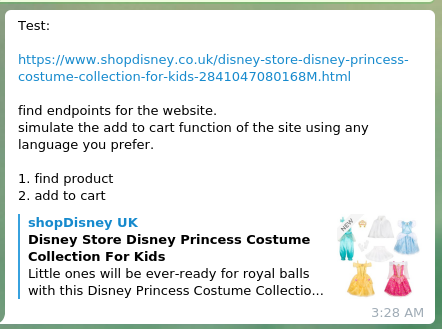
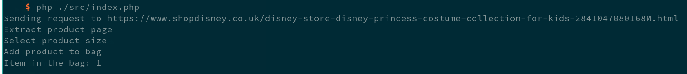

# WebCrawler

This project is created to fulfill job interview test. The test requirement can be seen in the figure below.
The main objective of this project is to add product to chart without using browser automation.

## Usage
1. Clone this repository
2. Install all the dependencies
3. Execute `index.php` using php interpreter

